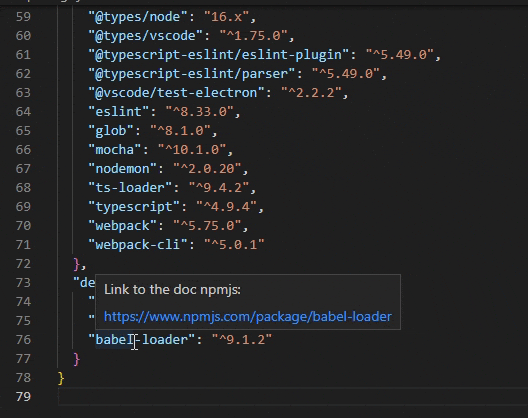

# Open doc in web

  

## Preview

## Features
* Hover a npm package to show the doc link.
* Command `Ctrl + Shift + P` `=>` `Open package/documentation in web`  to open the doc in your default browser.

## Change Log
See change Log [here](https://github.com/lMagickl/open-doc-in-web/blob/main/CHANGELOG.md).

## Issues
Submit the [issues](https://github.com/lMagickl/open-doc-in-web/issues) if you find any bug or have any suggestion.

## Contribution
[Fork](https://github.com/lMagickl/open-doc-in-web/fork) the repo and submit [pull requests](https://github.com/lMagickl/open-doc-in-web/pulls).